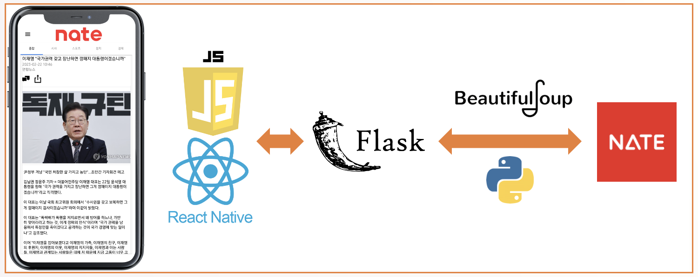

# NateNews
---
### SKT FLY AI 2nd(호날두조)
키워드 기반 뉴스 추천 서비스

## 앱

1. Nate에서 크롤링(인기 기사 페이지 / 기사 본문 html)
2. BeautifulSoup 파싱 및 전처리
3. Flask 통신
4. React Native로 렌더링

## 기본 앱 화면

__네이트 화면과 유사하게 구성__

## 기사 화면

* NLP모델(`SBERT` 기반) 추론 결과로 주요 문장 / 핵심 키워드 추출
* 핵심 키워드에 대한 기사 추천(네이트 뉴스 내부 검색엔진 이용)

## Model Desc.

* 한국언론진흥재단의 `kpfSBERT` 모델을 finetuning
* 네이트의 기사 약 10,000개(100개씩 100일)에 대해 전처리 수행 후 학습
* 기사간의 유사도를 학습하는 Self-Supervised 방법으로 학습